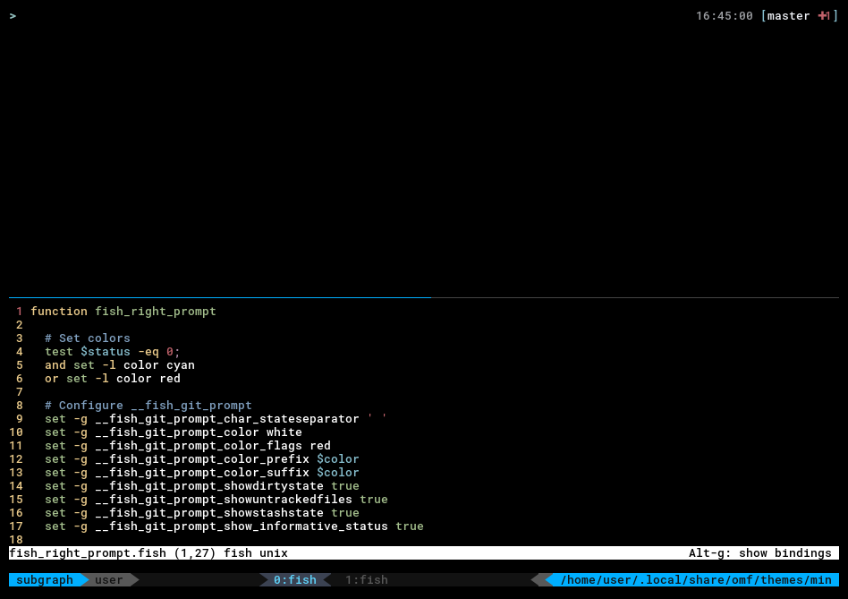

# min

> *A theme for [Oh My Fish](https://www.github.com/oh-my-fish/oh-my-fish).*

[](/LICENSE)
[](https://fishshell.com)
[](https://www.github.com/oh-my-fish/oh-my-fish)

<br/>



## Description

A minimal prompt for the fish shell to be used with [tmux](https://tmux.github.io).

## Install

Either with omf

```fish
omf install min
```

or [fisherman](https://github.com/fisherman/fisherman)

```fish
fisher gitlab.com/lusiadas/min
```

---

Ⓐ Made in Anarchy. No wage slaves were economically coerced into the making of this work.
